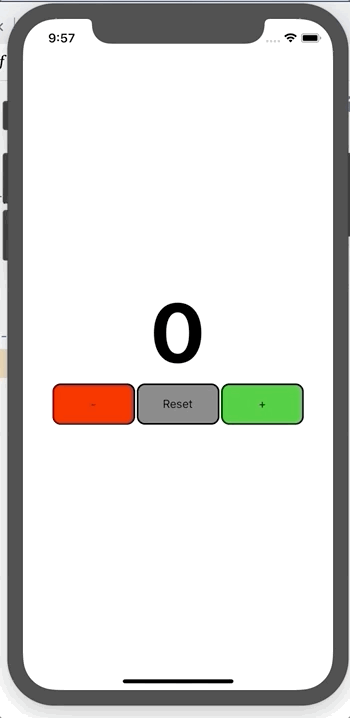

# React-native Redux counter example



This repository contains the code for a **react-native** counter app built with **redux** and **react-redux**.

It illustrates the basic redux principles of: 

* store
* actions
* reducer

I learned that you should:

* Wrap your main app in a `<Provider store={store}>` component
* Use `useSelector` to grab values from the store
* Use `useDispatch` to dispatch actions to the store
* Use named imports for action creators! `import { increment } ` instead of `import increment`!

## A very subtle mistake...

Don't do

```js
import increment from './redux/reducer';
```

Do

```js
import { increment } from './redux/reducer';
```

Otherwise you get this error

> React-Redux: Actions must be plain objects. Use custom middleware for async actions